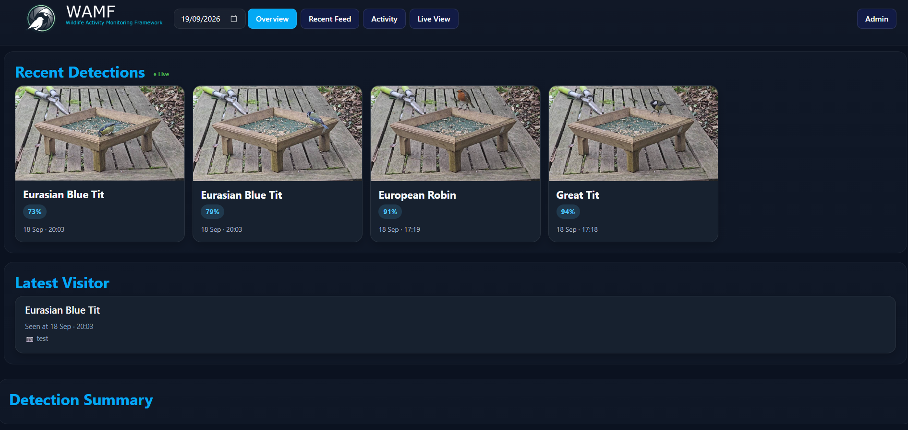
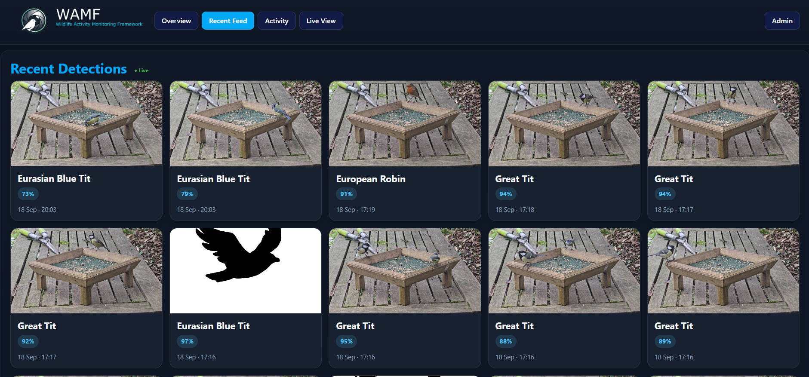
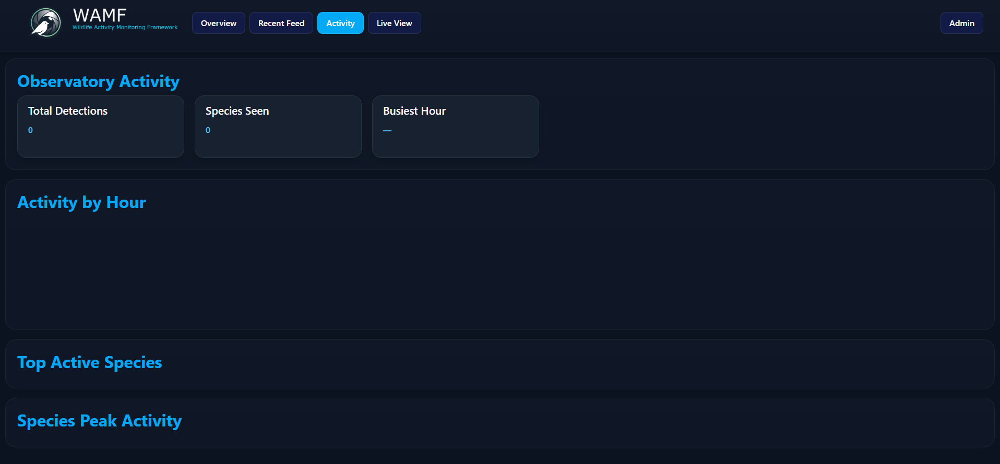

#  WAMF (Wildlife Activity Monitoring Framework)

> A wildlife observatory platform built around Frigate NVR, bird species identification, feeder activity analytics, and live wildlife monitoring.

---

## Project Background

WAMF is a fork of:

- https://github.com/k1n6b0b/whosatmyfeeder

Which itself is a fork of the original project:

- https://github.com/mmcc-xx/WhosAtMyFeeder

All original work and credit belongs to the original authors and contributors.

This fork has evolved beyond the original sidecar classifier concept and is now focused on building a modern wildlife observatory platform around:

- Frigate integration
- Species analytics
- Activity visualisation
- Observatory-style UI/UX
- Live detection feeds
- Species exploration
- Behaviour tracking

while remaining compatible with the original Frigate-based bird detection workflow.

---

# Observatory Features

## Detection Pipeline

- Bird species classification from Frigate snapshots
- SQLite-backed event storage
- MQTT integration
- Frigate sub-label support
- Confidence scoring
- Species taxonomy lookup database

## Observatory UI

- Live recent detections feed
- Daily summaries
- Hourly activity views
- Species exploration pages
- Activity analytics dashboard
- Interactive navigation between detections and species
- Mobile-friendly responsive interface
- Thumbnail abstraction layer for Frigate or development media

## Activity Analytics

- Activity-by-hour visualisation
- Species peak activity tracking
- Detection timelines
- Top visitor statistics
- Behaviour-focused observatory views

## Infrastructure

- MQTT TLS support
- GitHub Container Registry images
- Automated CI pipeline
- Vulnerability scanning
- Python 3.11 environment
- Modern Flask-based web UI

---

# Architecture

WAMF combines Frigate detections, species classification, and observatory analytics into a unified wildlife monitoring platform.

```text
Frigate → MQTT/Event Detection
        ↓
Species Classification
        ↓
SQLite Detection Store
        ↓
birdnames.db Taxonomy Lookup
        ↓
Flask Observatory UI
```

---

# Features Added In Previous Forks

## From k1n6b0b fork

- MQTT TLS support
- MQTT detection publish support
- MQTT new species alerts
- Frigate sub-label fallback support
- Python 3.11 base image
- GitHub Container Registry publishing
- CI pipeline improvements

## Features Added In This Fork

- Observatory dashboard redesign
- Live recent detection feed
- Activity analytics page
- Species activity tracking
- Interactive species navigation
- Thumbnail abstraction system
- Modernised observatory UI
- Improved responsive layouts
- Development thumbnail support
- Fake detection seeding workflows (For development only)
- Refactored analytics and summary views

---

# Screenshots

## Dashboard

An overview of recent wildlife observations and activity recorded by WAMF.



## Recent Observations

Recent bird detections with species identification and observation media.



## Activity

Bird activity over time, showing when wildlife is most active.



---

# Prerequisites

- A working Frigate installation
- An MQTT broker connected to Frigate
- Frigate configured to detect the bird object
- Snapshots enabled in Frigate

---

# Frigate Configuration

## Frigate must be configured to:

- detect birds
- generate snapshots
- publish MQTT events

Example configuration:

```yaml
mqtt:
  host: <your-mqtt-host>
  port: 1883
  topic_prefix: frigate
  user: mqtt_username_here
  password: mqtt_password_here

detectors:
  coral:
    type: edgetpu
    device: usb

objects:
  track:
    - bird

snapshots:
  enabled: true

cameras:
  birdcam:
    record:
      enabled: true
      events:
        objects:
          - bird

    ffmpeg:
      inputs:
        - path: rtsp://<camera-ip>:8554/cam
          roles:
            - detect
            - record
```

---

# Setup

## Directory Structure

```text

/WAMF/
├── docker-compose.yml
├── config/
│   └── config.yml
└── data/

```

---

# Configuration

Native startup creates `config/config.yml` from the example when absent. You can
also prepare it beforehand by copying:

```text

config/config.yml.example

```

to:

```text

config/config.yml

```

# Example:

```yaml
frigate:
  frigate_url: http://<frigate-ip>:5000

  mqtt_server: <mqtt-host>
  mqtt_auth: false
  mqtt_port: 1883

  main_topic: frigate

  camera:
    - birdcam

  object: bird

classification:
  model: model.tflite
  threshold: 0.7

webui:
  port: 7767
  host: 0.0.0.0
```

# Docker Compose

Build and run the current checkout:

```bash
docker compose -f docker-compose.yml.example up -d --build
docker compose -f docker-compose.yml.example logs -f
```

Open `http://<server-ip>:7767`. First startup creates configuration and prints a
temporary admin password. Sign in and configure Frigate/MQTT through the Admin UI.
Config, database, and media persist in `./config`, `./data`, and `./media`, mounted
beneath `/app`. See [Docker installation and testing](docs/docker-testing.md) for
setup, existing-install migration, and validation details.

---

# Development

```bash

python3.11 -m venv .venv

source .venv/bin/activate

pip install -r requirements.txt

```

Run the native application:

```bash
python speciesid.py
```

On first native start, WAMF creates `config/config.yml` from the native example
if it is missing. If Frigate, MQTT, or camera settings are incomplete, WAMF
starts the web/admin UI in setup mode on port 7767 (or your configured port).
The detection worker stays disabled, and health reports setup required instead
of treating placeholder settings as service outages.

Sign in and open Configuration to enter the Frigate URL, MQTT broker/topic,
camera names, and any required MQTT credentials/TLS options. Save & Restart
saves the configuration, stops and joins the workers, and re-executes the current
Python command in the same parent process. Restart applies the existing saved
configuration the same way. Both actions work directly in a terminal and under
systemd, without requiring an external supervisor to relaunch WAMF. The browser
waits for the new application instance, then reloads the Admin UI. Saving alone
shows a restart-required message and does not start detection. Advanced users can still edit the YAML file directly.
Structurally invalid configuration or invalid web bind settings remain startup errors.

With admin authentication enabled, missing or invalid bootstrap credentials are
replaced automatically. WAMF prints a random temporary admin password once to
the startup console, stores only its hash, and generates a session secret when
needed. Keep the temporary password, then sign in at `http://<server-ip>:7767/login`
and change it at `/admin/password`. Subsequent starts preserve valid credentials
and do not display the password again. Generated credentials are saved before
the web UI starts, so keep the password shown on that first run.
A config updated by credential bootstrap is restricted to its owner (mode 0600).

The native default port is 7767; existing configured ports are preserved. The
config, bundled model, and taxonomy database resolve from the application
location. `WHOSATMYFEEDER_CONFIG` can select another existing file (relative paths
are relative to the caller's working directory); a missing override is an error.
`WAMF_SECRET_KEY`, when set to a valid value, continues to override the configured
session secret. Runtime storage directories and the SQLite schema are created
automatically. The runtime account needs write access for bootstrap and admin
configuration changes.

Wait for `MQTT event subscription ready` in the console before testing a new
bird event. This message follows the broker subscription acknowledgement.
MQTT retained deliveries are skipped explicitly. The first live `new` bird event
on the configured topic and camera is processed, including after a cold start.

Run tests:

```bash
pytest tests/ -v

```

---

# Development Notes

## Bridge events

When enabled, the Bridge integration emits events for newly committed
observations and for overall health state changes. Health events are sent only
when WAMF's background monitor detects a move between healthy, degraded, and
unhealthy states. The monitor runs every 60 seconds by default, including when
Bridge delivery is disabled. Delivery is best effort; Bridge outages never
interrupt WAMF processing or health checks.

## WAMF currently supports:

- Frigate-backed thumbnails
- Static development thumbnails
- Fake detection seeding for UI testing
- SQLite development workflows

This allows rapid UI and analytics development without requiring a live Frigate deployment during testing.

---

# Roadmap

## Planned and experimental observatory features include:

- Real-time Frigate event streaming
- Species heatmaps
- Dawn/dusk activity overlays
- Seasonal behaviour analysis
- Weather integration
- Multi-camera observatories
- Notification and alerting systems
- Long-term wildlife trend analysis

---

# Attribution

Original project:

https://github.com/mmcc-xx/WhosAtMyFeeder

Intermediate fork:

https://github.com/k1n6b0b/whosatmyfeeder

This repository continues to build upon both projects while evolving toward a broader wildlife observatory platform.

## License

This project is licensed under the MIT License.  
See the LICENSE file for details.
